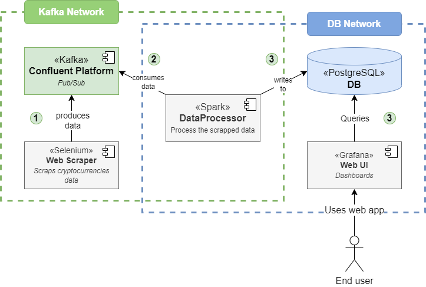

# CryptoViz Project
  

## Introduction

CryptoViz is a web-based big-data application that will help our client be fast and competitive. It must help the client with the following tasks:
- continuously **collect data** from a cryptocurrency news feed ;
- continuously process the collected data and **provide analytics** ;
- dynamically **visualize** the provided analytics with the appropriate graphs. 

### Main components
1. Online Web Scraper
    - Continuously collect data from a cryptocurrency news feed.
    - It is always running and collecting data.
2. Online Analytics Builder
    - Processes the scrapped data.
    - Always online
    - It should be as fast as possible.
3. Dynamic Viewer
    - Updates itself with the analytics built by the previous component.
    - Includes a temporal dimension in order to explore the evolution of the analytics and provide insight for the business decision makers.

## Architecture

The project uses the microservice architecture defined in the *CryptoViz.drawio* schema:
- On *Google confluent cloud*: **kafka cluster** for centralizing the stream of scraped data using the producer/consumer paradigm
- On *Google DataProc*: **Spark streaming application** for computing the live analytics
- On *Google CloudSQL*: **postgres db** to store the result of analytics computing 
- On *Google Cloud kubernetes* engine:
    - **Scrappy web Scraper**
    - Crypto dashboard API : **express + typescript**
    - Crypto dashboard WebApp : **react + typescript**

## Developement

### Mimicing cloud services locally
For development, the cloud services will be simulated this way :
- **Confluent cloud :** Confluent platform (see *./_Infra/README.md* for initial setup.)
- **CloudSQL :** postgres db docker image in *./Infra/db*. (see *./_Infra/README.md* for initial setup.)
- **DataProc :**  local cluster defined inside the docker compose project SparkApp. No setup required.

When the corresponding containers are running, you can find :
- Confluent's Control Center at [http://localhost:9021/](http://localhost:9021/)
- Postgres DB's admin at [http://localhost:8092/](http://localhost:8092/) (see ./_Infra/README.md for initial log in and db connection )
- Spark Master's Overview at [localhost:8079](localhost:8079) 

### Run the system locally
The whole system can be started by running the *up.sh* script (with command `./up.sh`), and then stopped with the  *down.sh* script (`./down.sh`).

Each service can also be run independently, with its minimal dependencies (ex: You need to start the Kafka Cluster and postgres db before running the Spark App).

### Developement worflow

For each sub-project, you can either :
- Install dependencies locally 
- Use vscode's Remote Explorer to develop directcly from inside the container *(recommended)*

## Deployment

The application is containerized using Docker. For Terraform cloud ressources provisionning and Kubernetes deployment, refer to the `_Infra` repository.
